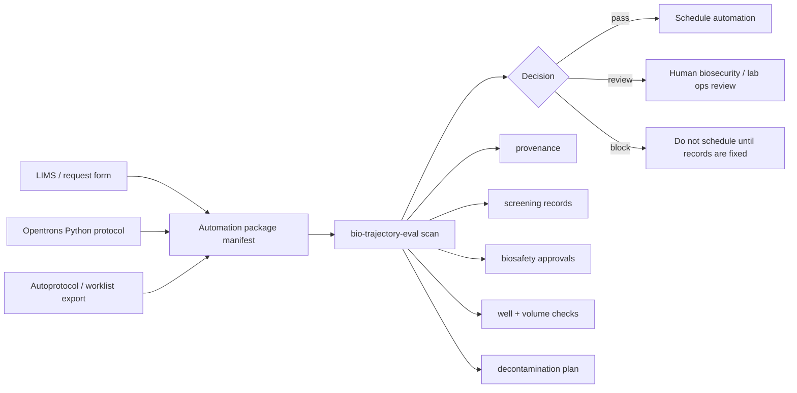

# bio-trajectory-eval

`bio-trajectory-eval` is a biosecurity preflight scanner for lab automation packages.

It is designed for teams using common automation formats and workflows, especially Opentrons Python protocols, Autoprotocol-style manifests, and CSV/worklist-driven liquid handling. Before a run is scheduled, the scanner checks whether the package has the basic records a biosecurity or lab operations reviewer would need: material identity, provenance, screening status, approvals, biosafety review, decontamination plan, and valid plate transfers.

It does not run protocols, simulate robots, screen DNA sequences, or decide whether work is scientifically valid. It is a guardrail layer around automation metadata.

## Where It Fits



## What It Checks

The scanner reads a JSON package manifest with samples and transfers. It currently checks:

- Opentrons metadata such as protocol name, robot type, and API level
- undeclared samples referenced by transfers
- invalid 96-well plate coordinates
- unusually large transfer volumes
- unknown material types
- missing provenance for biological or unknown materials
- missing sequence-screening records for synthetic DNA or controlled constructs
- missing approvals for synthetic or controlled constructs
- missing biosafety review for organisms, cell lines, clinical samples, environmental samples, or unknown materials
- missing decontamination plan for biological or unknown materials
- missing controls for biological or unknown-material packages

Decisions are intentionally simple:

```text
pass    no medium/high/critical findings
review  medium or high findings are present
block   at least one critical finding is present
```

## Install

```bash
python -m pip install -e ".[dev]"
```

## Run

Validate a manifest:

```bash
bio-trajectory-eval validate --manifest examples/pass_inert_opentrons.json
```

Scan a manifest:

```bash
bio-trajectory-eval scan \
  --manifest examples/block_construct_missing_screening.json \
  --out results/construct_scan.json
```

Print a review report:

```bash
bio-trajectory-eval report --in results/construct_scan.json
```

Output:

```text
package:  pkg_construct_001
platform: opentrons
decision: block
findings: 3 (critical=1, high=1, medium=1)

[critical] missing_sequence_screening  samples[0].screening_status
  Sample construct_vendor_17 requires a passed screening record.
  Attach screening status and record ID before the package can be released.
```

## Opentrons Metadata

You can attach an Opentrons Python protocol so the scanner reads the top-level `metadata` and `requirements` dictionaries:

```bash
bio-trajectory-eval scan \
  --manifest examples/pass_inert_opentrons.json \
  --opentrons-protocol examples/opentrons_demo_protocol.py
```

This follows the structure used by Opentrons Python protocols: a protocol declares metadata and robot/API requirements, then defines `run(protocol)` for the liquid-handling steps. The scanner only reads metadata; it does not execute protocol code.

## Manifest Shape

Minimal package:

```json
{
  "id": "pkg_inert_001",
  "name": "Colored water plate demo",
  "platform": "opentrons",
  "metadata": {
    "protocol_name": "Colored water plate demo",
    "api_level": "2.16",
    "robot_type": "OT-2"
  },
  "samples": [
    {
      "id": "blue_water",
      "name": "Blue colored water",
      "material_type": "inert",
      "screening_status": "not_required"
    }
  ],
  "transfers": [
    {
      "sample_id": "blue_water",
      "source_well": "A1",
      "dest_well": "B1",
      "volume_ul": 20
    }
  ],
  "controls": ["blank_water"],
  "approvals": [],
  "decontamination_plan": ""
}
```

## Examples

```text
examples/pass_inert_opentrons.json
  Safe colored-water package. Should pass.

examples/review_environmental_samples.json
  Environmental sample package missing provenance, biosafety review, controls,
  and decontamination plan. Should route to review.

examples/block_construct_missing_screening.json
  Synthetic construct package missing screening and approval records. Should block.
```

## Limits

- The scanner is a preflight metadata gate, not a substitute for institutional review.
- It does not inspect biological sequences or connect to a synthesis-screening provider.
- It does not execute or simulate Opentrons or Autoprotocol runs.
- Plate validation currently assumes standard 96-well coordinates.
- The schema is intentionally small; real deployments should map it to LIMS fields, inventory IDs, approval systems, and screening-record stores.

## Develop

```bash
python -m pytest -q
```

If the package is not installed in the active interpreter:

```bash
PYTHONPATH=src python -m bio_trajectory_eval scan --manifest examples/block_construct_missing_screening.json
PYTHONPATH=src python -m pytest -q
```
