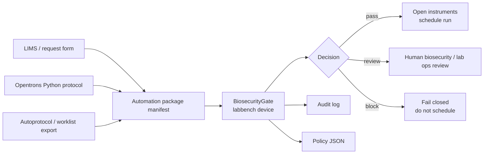

# bio-trajectory-eval

`bio-trajectory-eval` is a labbench-based biosecurity gate for automated lab runs.

It is meant to sit inside a Python lab automation workflow before instruments are opened or a liquid-handler run is scheduled. The core object is a labbench-compatible virtual device, `BiosecurityGate`, that scans an automation package manifest and returns a `pass`, `review`, or `block` decision with auditable findings.

The tool is not trying to decide whether biology is safe from first principles. It checks whether the records needed for a responsible automation run are present and internally consistent: material identity, provenance, screening status, approvals, biosafety review, controls, decontamination plan, and transfer geometry.

## Why Labbench

`labbench` is a Python toolkit for laboratory automation scripts, device wrappers, reusable procedures, and automatic logging. That makes it a better foundation than a standalone command-line checker: the biosecurity gate can be treated like any other device in an automation rack, called before the robot is scheduled, and logged with the rest of the run metadata.

`bio-trajectory-eval` still provides a CLI, but the main integration target is this pattern:

```python
import labbench as lb
from bio_trajectory_eval.labbench_gate import BiosecurityGate


class AutomationRack(lb.Rack):
    gate = BiosecurityGate(
        policy_path="examples/policy_default.json",
        audit_log="results/biosecurity_gate_audit.jsonl",
    )

    def preflight(self, manifest: str):
        return self.gate.assert_clearance(manifest)

    def run_liquid_handler(self):
        return "scheduled"


with AutomationRack() as rack:
    rack.preflight("examples/pass_inert_opentrons.json")
    rack.run_liquid_handler()
```

## Where It Fits



## What Is Being Evaluated

The scanner evaluates automation readiness.

It checks:

- Opentrons protocol metadata such as protocol name, robot type, and API level
- undeclared samples referenced by transfers
- invalid plate coordinates under the configured labware rule
- unusually large transfer volumes
- unknown material types
- missing provenance for biological, unknown, or external materials
- missing sequence-screening records for synthetic DNA or controlled constructs
- missing approvals for synthetic, controlled, or BSL-2+ materials
- missing biosafety review for organisms, cell lines, clinical samples, environmental samples, or unknown materials
- missing controls and decontamination plans for biological or unknown-material packages
- high-throughput packages without reviewer signoff

Decisions are policy-dependent:

```text
pass    no medium/high/critical findings under the active policy
review  human review is required before scheduling
block   the automation script should fail closed
```

## Policy

Policies are JSON files. They let a lab decide how conservative the gate should be.

```json
{
  "name": "strict_unknowns_block",
  "block_on_unknown_material": true,
  "block_on_missing_sequence_screening": true,
  "max_transfer_ul_without_review": 500,
  "high_throughput_transfer_count": 48,
  "finding_actions": {
    "missing_biosafety_review": "block_run"
  }
}
```

The default examples are:

```text
examples/policy_default.json
examples/policy_strict.json
```

## Install

```bash
python -m pip install -e ".[dev]"
```

This installs `labbench` and the local package.

## CLI

Validate a manifest:

```bash
bio-trajectory-eval validate --manifest examples/pass_inert_opentrons.json
```

Scan with a policy:

```bash
bio-trajectory-eval scan \
  --manifest examples/block_construct_missing_screening.json \
  --policy examples/policy_default.json \
  --out results/construct_scan.json
```

Use the labbench gate path from the CLI:

```bash
bio-trajectory-eval gate \
  --manifest examples/pass_inert_opentrons.json \
  --policy examples/policy_default.json \
  --audit-log results/gate_audit.jsonl
```

Print a review report:

```bash
bio-trajectory-eval report --in results/construct_scan.json
```

## Opentrons Metadata

The scanner can read top-level Opentrons `metadata` and `requirements` dictionaries without executing the protocol:

```bash
bio-trajectory-eval scan \
  --manifest examples/pass_inert_opentrons.json \
  --opentrons-protocol examples/opentrons_demo_protocol.py
```

This is intentionally shallow. It reads metadata for audit and compatibility checks; it does not simulate robot motion or inspect biological intent from code.

## Examples

```text
examples/pass_inert_opentrons.json
  Inert colored-water package. Should pass.

examples/review_environmental_samples.json
  Environmental sample package missing provenance, biosafety review, controls,
  and decontamination plan. Should route to review.

examples/block_construct_missing_screening.json
  Synthetic construct package missing screening and approval records. Should block.

examples/labbench_gate_demo.py
  Minimal labbench Rack using BiosecurityGate before scheduling automation.
```

## Limits

- This is a metadata and policy gate, not a replacement for institutional biosafety review.
- It does not screen nucleotide sequences or connect to a screening provider.
- It does not execute, simulate, or verify Opentrons or Autoprotocol procedures.
- Transfer validation currently uses one configured labware rule per package.
- Real deployments should map the manifest to LIMS fields, inventory IDs, approval systems, screening records, and audit logging requirements.

## Develop

```bash
python -m pytest -q
```

Without installing the package:

```bash
PYTHONPATH=src python -m bio_trajectory_eval scan \
  --manifest examples/block_construct_missing_screening.json \
  --policy examples/policy_default.json
PYTHONPATH=src python -m pytest -q
```
